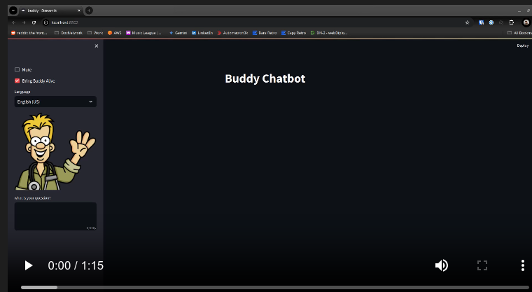

# buddy
DocNetwork Hackathon project 2024

Buddy is a LLM based chatbot.  It's built on the following technologies:
- AWS Bedrock 
- Anthropic’s Claude v2 LLM
- AWS Polly 
- Google - Voice Transcription
- Python with streamlit

Buddy can do the following:
- Answer domain specific questions.
    - We created a RAG in bedrock build from our support macros.  We wanted to prove that we could feed it 
      domain specific information so that it could provide product specific support.
- Turn the text to audio and play it outloud
- Lipsync to that audio.  The bot is animated
- Record audio and transcribe that to text so that you can talk to buddy.

I have buddy running on our K8s cluster but you can also run it locally.

I am not including setup instructions.  This was just a POC hackathon project, not  a real finish product.

